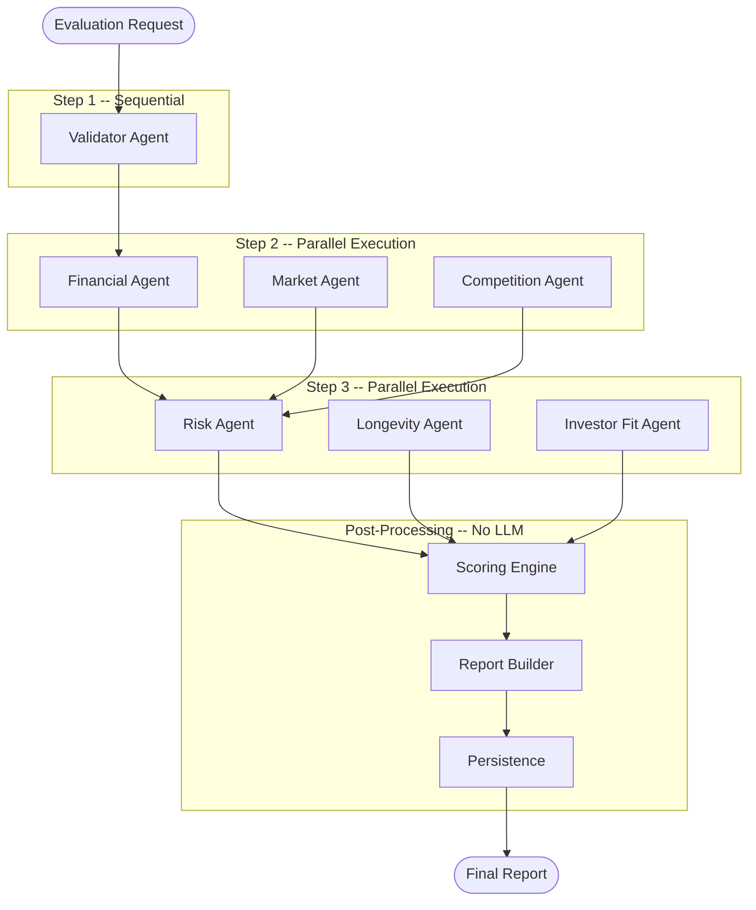
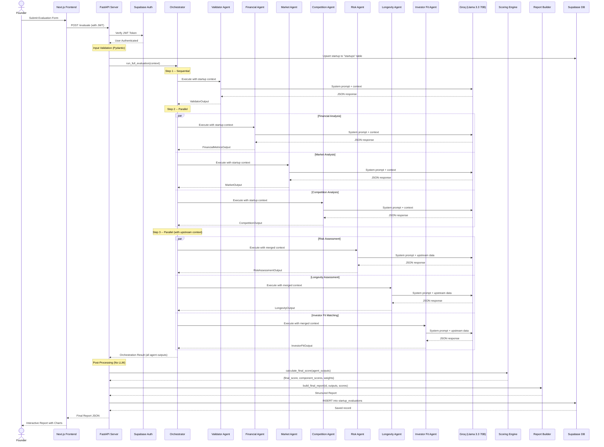
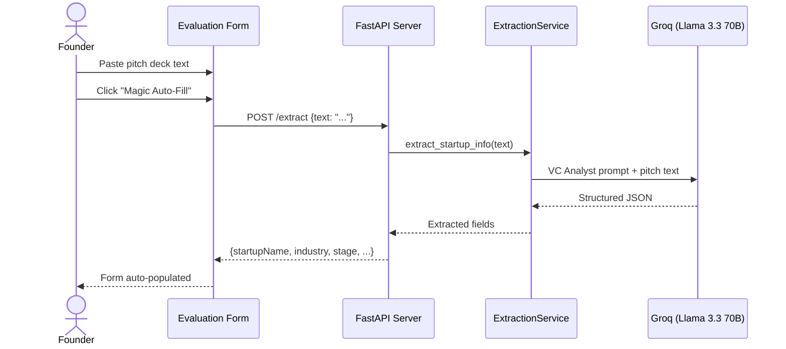
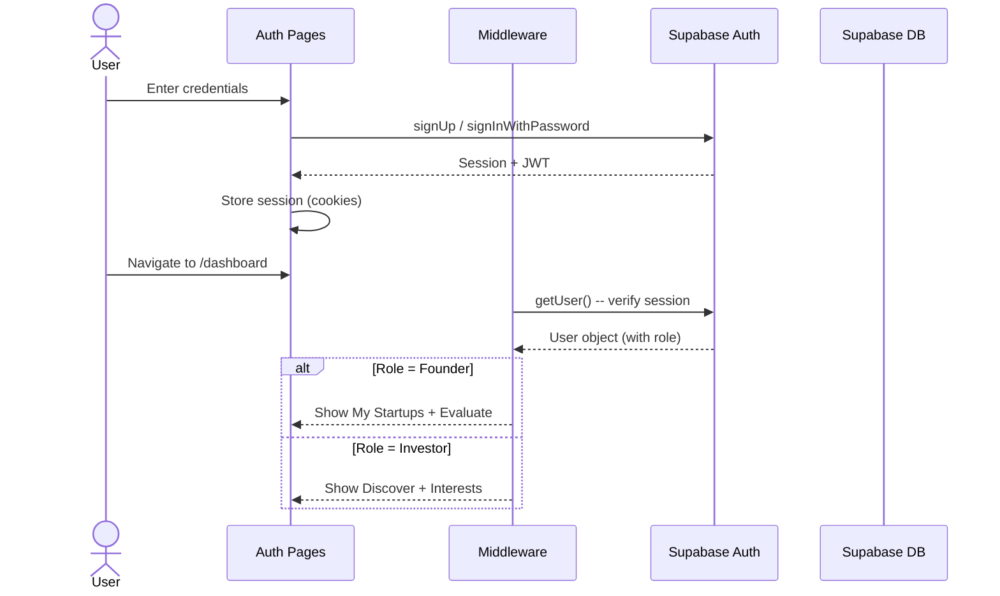

<p align="center">
  <h1 align="center">IdeaEvaluator</h1>
  <p align="center">
    <strong>LLM-Orchestrated Startup Evaluation Workflow System</strong>
  </p>
  <p align="center">
    A multi-agent intelligence system that evaluates startup ideas across 7 domains -- Financial Health, Market Potential, Competition, Risk, Longevity, Validation & Investor Fit -- delivering structured reports in seconds.
  </p>
</p>

<p align="center">
  
  
  
  
  
  
</p>

---

## Table of Contents

- [Overview](#overview)
- [Features](#features)
- [Tech Stack](#tech-stack)
- [Architecture](#architecture)
- [Backend Structure](#backend-structure)
- [Multi-Agent Pipeline](#multi-agent-pipeline)
- [Sequence Diagrams](#sequence-diagrams)
- [Data Flow](#data-flow)
- [Database Schema](#database-schema)
- [Getting Started](#getting-started)
- [API Reference](#api-reference)
- [Project Structure](#project-structure)
- [Environment Variables](#environment-variables)
- [License](#license)

---

## Overview

**IdeaEvaluator** is a full-stack startup evaluation platform that leverages Microsoft's **AutoGen v0.7** multi-agent framework to orchestrate 7 specialized AI agents. Each agent analyzes a different domain of a startup -- from financial viability to investor fit -- producing a structured multi-domain evaluation report.

The platform features:
- A **5-step evaluation form** for founders to submit their startup data
- An **AI-powered extraction service** (Magic Auto-Fill) from pitch deck text
- A **deterministic scoring engine** (no LLM) for final investment scores
- Role-based views for **Founders** and **Investors**
- Real-time report generation with interactive charts and visualizations

---

## Features

| Feature | Description |
|---|---|
| **7-Agent AI Analysis** | Parallel multi-agent evaluation across Financial, Market, Competition, Risk, Longevity, Validation, and Investor Fit domains |
| **Smart Evaluation Form** | 5-step guided submission with auto-save, validation, and confidence scoring |
| **Magic Auto-Fill** | Paste a pitch deck and let AI extract structured data for the form |
| **Interactive Reports** | Recharts-powered visualizations with radar charts, bar charts, and score breakdowns |
| **Supabase Auth** | Email/password, magic link, and OAuth authentication with RLS policies |
| **Role-Based Views** | Founder dashboard (My Startups) vs Investor dashboard (Discover + Interests) |
| **Dark/Light Mode** | Theme toggle with `next-themes` and system preference detection |
| **Parallel Execution** | `asyncio.gather`-based parallel agent execution for faster evaluations |
| **Error Isolation** | Individual agent failures don't crash the pipeline -- graceful degradation |
| **Evaluation Persistence** | Reports stored in Supabase (PostgreSQL) with user ownership |

---

## Tech Stack

### Frontend

| Technology | Version | Purpose |
|---|---|---|
| **Next.js** | 16.1.6 | React framework with App Router, SSR, API routes |
| **React** | 19.2.3 | UI component library |
| **TailwindCSS** | 4.x | Utility-first CSS framework |
| **Framer Motion** | 12.34.0 | Page transitions, micro-animations |
| **Recharts** | 3.7.0 | Chart visualizations (radar, bar, line) |
| **Radix UI** | 1.4.3 | Accessible headless UI primitives |
| **shadcn/ui** | 3.8.4 | Pre-built component library (built on Radix) |
| **Lucide React** | 0.563.0 | Icon library |
| **Sonner** | 2.0.7 | Toast notifications |
| **next-themes** | 0.4.6 | Dark/light mode theming |
| **Supabase SSR** | 0.8.0 | Server-side Supabase auth integration |

### Backend

| Technology | Version | Purpose |
|---|---|---|
| **FastAPI** | latest | Async Python API framework |
| **AutoGen AgentChat** | 0.7.x | Microsoft's multi-agent orchestration framework |
| **AutoGen Core** | 0.7.x | Core agent primitives and cancellation tokens |
| **AutoGen Ext (OpenAI)** | 0.7.x | OpenAI-compatible model client (used with Groq) |
| **Groq** | latest | Ultra-fast LLM inference (Llama 3.3 70B Versatile) |
| **Pydantic** | v2 | Data validation and serialization for all I/O |
| **Supabase Python** | latest | Database client (PostgreSQL) |
| **Uvicorn** | latest | ASGI server |
| **python-dotenv** | latest | Environment variable management |

### Infrastructure

| Service | Purpose |
|---|---|
| **Supabase** | Authentication (Auth), PostgreSQL database, Row Level Security |
| **Groq Cloud** | LLM inference API (Llama 3.3 70B @ ~750 tokens/sec) |

---

## Architecture

### High-Level System Architecture


### Layered Architecture

The backend follows an **8-layer architecture** for clean separation of concerns:

```mermaid
graph LR
    subgraph "Layer 1 -- Data & Schemas"
        L1[Pydantic Models<br/>StartupContext, FinancialRawInput]
    end
    
    subgraph "Layer 2 -- LLM Configuration"
        L2[Groq Config<br/>Llama 3.3 70B, temp=0.2]
    end
    
    subgraph "Layer 3 -- Agent Framework"
        L3[Base Agent<br/>Template Method Pattern]
    end
    
    subgraph "Layer 4 -- Specialist Agents"
        L4[7 AutoGen Agents<br/>Each with System Prompts]
    end
    
    subgraph "Layer 5 -- Orchestration"
        L5[Orchestrator<br/>Pipeline Control + Parallel Execution]
    end
    
    subgraph "Layer 6 -- Scoring"
        L6[Scoring Engine<br/>Weighted Deterministic Score]
    end
    
    subgraph "Layer 7 -- Reporting"
        L7[Report Builder<br/>Structured Report Assembly]
    end
    
    subgraph "Layer 8 -- Persistence"
        L8[Evaluation Repository<br/>Supabase/PostgreSQL]
    end

    L1 --> L2 --> L3 --> L4 --> L5 --> L6 --> L7 --> L8
```



---

## Backend Structure

```
backend/
|-- __init__.py
|-- main.py                         # FastAPI app entry, /evaluate & /extract endpoints
|-- models.py                       # All Pydantic models (Input + Agent Output schemas)
|-- llm_config.py                   # Groq LLM configuration (model, temp, max_tokens)
|-- extraction_service.py           # Magic Auto-Fill -- extracts structured data from text
|-- finance_engine.py               # Pre-computes financial metrics before agent analysis
|
|-- agents/                         # Layer 3-4: Agent Framework
|   |-- __init__.py
|   |-- base_agent.py               # Abstract base with Template Method pattern
|   |-- autogen_registry.py         # Factory -- initializes all 7 agents + user proxy
|   |-- autogen_utils.py            # Model client creation, prompt loading
|   |-- production_agent.py         # Production-grade wrapper with retries
|   |-- validator_agent.py          # Data consistency & completeness checker
|   |-- financial_agent.py          # Financial health analysis
|   |-- market_agent.py             # TAM/SAM/SOM & market growth estimation
|   |-- competition_agent.py        # Competitive landscape & novelty scoring
|   |-- risk_agent.py               # Risk identification & severity scoring
|   |-- longevity_agent.py          # 3yr/5yr survival likelihood estimation based on upstream analysis
|   |-- investor_fit_agent.py       # Investor type & stage matching
|
|-- orchestrator/                   # Layer 5: Pipeline Orchestration
|   |-- __init__.py
|   |-- autogen_orchestrator.py     # Main pipeline controller (5-step execution)
|   |-- autogen_execution_wrapper.py # Single-agent async executor with error isolation
|   |-- autogen_parallel_executor.py # asyncio.gather wrapper for parallel agents
|   |-- autogen_context_builder.py  # Immutable context merging for downstream agents
|   |-- autogen_result_aggregator.py # Packages all outputs into final result
|
|-- prompts/                        # Agent system prompts (text files)
|   |-- validator_system.txt
|   |-- financial_system.txt
|   |-- market_system.txt
|   |-- competition_system.txt
|   |-- risk_system.txt
|   |-- longevity_system.txt
|   |-- investor_fit_system.txt
|
|-- schemas/                        # JSON Schema definitions
|   |-- StartupContext.json
|   |-- FinancialRawInput.json
|   |-- FinancialMetricsOutput.json
|   |-- MarketOutput.json
|   |-- RiskOutput.json
|   |-- ReportOutput.json
|
|-- scoring/                        # Layers 6-8: Post-Processing
|   |-- __init__.py
|   |-- scoring_engine.py           # Deterministic weighted scoring (no LLM)
|   |-- report_builder.py           # Structured report assembly (no LLM)
|   |-- evaluation_service.py       # Integration layer (Score -> Report -> Persist)
|   |-- evaluation_repository.py    # Supabase persistence with dry-run mode
|
|-- tests/                          # Test suite
```

---

## Multi-Agent Pipeline

The evaluation pipeline uses **7 specialist AutoGen agents** orchestrated in a deterministic, dependency-aware order:

### Agent Overview

| Agent | Domain | Key Outputs | Depends On |
|---|---|---|---|
| **Validator** | Data Quality | Consistency score, completeness score, suspicion flags | Raw input |
| **Financial** | Financial Health | EBITDA, burn rate, runway, ARR, gross margin, health score | Raw input |
| **Market** | Market Potential | TAM/SAM/SOM estimates, market growth score, trends | Raw input |
| **Competition** | Competitive Landscape | Competitor risk score, novelty score, similar companies | Raw input |
| **Risk** | Risk Assessment | Top risks, severity score, executive summary | Financial + Market + Competition |
| **Longevity** | Survival Assessment | 3-year & 5-year survival probabilities, reasoning | All upstream agents |
| **Investor Fit** | Investor Matching | Recommended investor type, stage, ticket size, domain analysis | All upstream agents |

### Pipeline Execution Order



### Scoring Weights

The final investment score is calculated using a **deterministic weighted formula** (no LLM involved):

| Component | Weight | Score Source |
|---|---|---|
| Financial Health | **30%** | `financial_health_score` from Financial Agent |
| Risk (inverted) | **30%** | `1 - risk_severity_score` from Risk Agent |
| Market Growth | **20%** | `market_growth_score` from Market Agent |
| Validation Quality | **20%** | Average of `data_consistency_score` + `completeness_score` |

**Risk Label Classification:**
- `LOW_RISK` -- Final Score > 0.75
- `MEDIUM_RISK` -- Final Score > 0.50
- `HIGH_RISK` -- Final Score <= 0.50

---

## Sequence Diagrams

### 1. Full Evaluation Flow



### 2. Magic Auto-Fill (Extraction) Flow



### 3. Authentication Flow



### 4. Agent Execution Detail


---

## Data Flow

### Class Diagram -- Pydantic Models


---

## Database Schema


---

## Getting Started

### Prerequisites

| Tool | Version |
|---|---|
| **Node.js** | 18+ |
| **Python** | 3.10+ |
| **npm** | 9+ |
| **Supabase** | Project with Auth enabled |
| **Groq API Key** | [console.groq.com](https://console.groq.com) |

### 1. Clone the Repository

```bash
git clone https://github.com/SameerShaik786/startup-idea-evaluator.git
cd startup-idea-evaluator
```

### 2. Install Frontend Dependencies

```bash
npm install
```

### 3. Install Backend Dependencies

```bash
pip install -r requirements.txt
```

### 4. Configure Environment Variables

Create a `.env` file in the project root:

```env
# Supabase
NEXT_PUBLIC_SUPABASE_URL=https://your-project.supabase.co
NEXT_PUBLIC_SUPABASE_ANON_KEY=your-anon-key

# Groq LLM
GROQ_API_KEY=your-groq-api-key
```

### 5. Run the Backend

```bash
uvicorn backend.main:app --reload --port 8000
```

### 6. Run the Frontend

```bash
npm run dev
```

The app will be available at:
- **Frontend:** [http://localhost:3000](http://localhost:3000)
- **Backend API:** [http://localhost:8000](http://localhost:8000)
- **API Docs (Swagger):** [http://localhost:8000/docs](http://localhost:8000/docs)

---

## API Reference

### `GET /`
Health check endpoint.

**Response:**
```json
{ "status": "ok", "service": "IdeaEvaluator Backend" }
```

### `POST /extract`
Extract structured startup information from unstructured text (pitch decks, descriptions).

**Request Body:**
```json
{
  "text": "We are building an AI-powered platform that helps..."
}
```

**Response:**
```json
{
  "startupName": "Example AI",
  "industry": "AI / Machine Learning",
  "stage": "Seed",
  "problemDescription": "...",
  "targetCustomerPersona": "...",
  ...
}
```

### `POST /evaluate`
Run the full 7-agent evaluation pipeline. Requires authentication.

**Request Body:**
```json
{
  "startup_context": {
    "name": "My Startup",
    "industry": "FinTech",
    "stage": "Seed",
    "description": "..."
  },
  "financial_raw_input": {
    "period_start": "2025-01-01",
    "period_end": "2025-12-31",
    "revenue": 120000,
    "cogs": 30000,
    "operating_expenses": 80000,
    "cash_balance": 500000,
    "monthly_burn_rate": 15000
  },
  "qualitative": {
    "problem_description": "...",
    "product_description": "..."
  },
  "metadata": {},
  "user_id": "uuid-of-authenticated-user"
}
```

**Response:**
```json
{
  "startup_id": "uuid",
  "final_score": 0.72,
  "risk_label": "MEDIUM_RISK",
  "component_scores": {
    "financial": 0.85,
    "market": 0.70,
    "risk": 0.55,
    "validator": 0.80
  },
  "agent_results": { ... },
  "summary": { ... }
}
```

---

## Project Structure

```
ideaevaluator/
|-- app/                          # Next.js App Router
|   |-- (auth)/                   # Auth pages (login, signup, magic-link)
|   |-- (dashboard)/              # Protected dashboard routes
|   |   |-- page.jsx              # Dashboard home
|   |   |-- evaluate/             # Evaluation form page
|   |   |-- reports/              # Report viewing page
|   |   |-- discover/             # Investor discovery page
|   |   |-- interests/            # Investor interests page
|   |   |-- startups/             # Founder's startups page
|   |   |-- settings/             # User settings page
|   |-- auth/                     # Auth callback handler
|   |-- globals.css               # Global styles & design tokens
|   |-- layout.js                 # Root layout with providers
|
|-- components/                   # React components
|   |-- auth/                     # Auth forms and guards
|   |-- charts/                   # Recharts visualizations
|   |-- evaluate/                 # Multi-step evaluation form
|   |-- layout/                   # Sidebar, header, navigation
|   |-- report/                   # Report sections and cards
|   |-- ui/                       # shadcn/ui primitives
|
|-- lib/                          # Shared utilities
|   |-- supabase/                 # Supabase client (browser + server)
|   |-- utils.js                  # General helpers
|
|-- backend/                      # Python FastAPI backend
|   |-- agents/                   # 7 specialist AI agents
|   |-- orchestrator/             # Multi-agent pipeline control
|   |-- prompts/                  # Agent system prompts
|   |-- schemas/                  # JSON Schema definitions
|   |-- scoring/                  # Scoring + Reporting + Persistence
|   |-- tests/                    # Test suite
|
|-- middleware.js                  # Next.js auth middleware
|-- package.json                  # Frontend dependencies
|-- requirements.txt              # Backend dependencies
|-- next.config.mjs               # Next.js configuration
```

---

## Environment Variables

| Variable | Required | Description |
|---|---|---|
| `NEXT_PUBLIC_SUPABASE_URL` | Yes | Supabase project URL |
| `NEXT_PUBLIC_SUPABASE_ANON_KEY` | Yes | Supabase anonymous/public key |
| `GROQ_API_KEY` | Yes | Groq Cloud API key for LLM inference |

---

## Contributing

1. Fork the repository
2. Create your feature branch (`git checkout -b feature/amazing-feature`)
3. Commit your changes (`git commit -m 'Add amazing feature'`)
4. Push to the branch (`git push origin feature/amazing-feature`)
5. Open a Pull Request

---

## License

This project is private and proprietary.

---

<p align="center">
  Built with Next.js, AutoGen, FastAPI, and Groq
</p>
